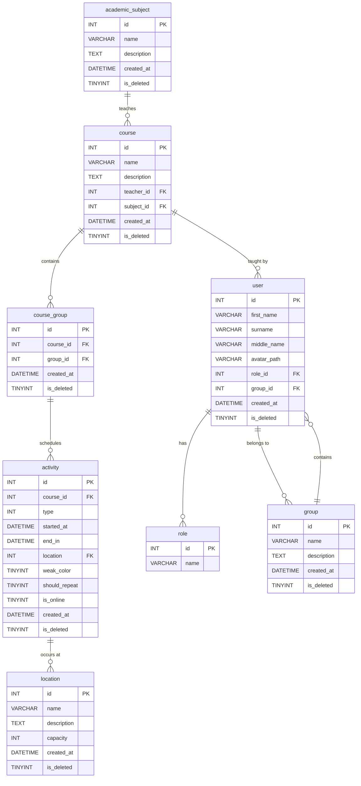

# SUPABASE + NEXT JS

```mermaid
erDiagram
    academic_subject {
        INT id PK
        VARCHAR name
        TEXT description
        DATETIME created_at
        TINYINT is_deleted
    }
    
    course {
        INT id PK
        VARCHAR name
        TEXT description
        INT teacher_id FK
        INT subject_id FK
        DATETIME created_at
        TINYINT is_deleted
    }
    
    course_group {
        INT id PK
        INT course_id FK
        INT group_id FK
        DATETIME created_at
        TINYINT is_deleted
    }
    
    activity {
        INT id PK
        INT course_id FK
        INT type
        DATETIME started_at
        DATETIME end_in
        INT location FK
        TINYINT weak_color
        TINYINT should_repeat
        TINYINT is_online
        DATETIME created_at
        TINYINT is_deleted
    }
    
    location {
        INT id PK
        VARCHAR name
        TEXT description
        INT capacity
        DATETIME created_at
        TINYINT is_deleted
    }
    
    user {
        INT id PK
        VARCHAR first_name
        VARCHAR surname
        VARCHAR middle_name
        VARCHAR avatar_path
        INT role_id FK
        INT group_id FK
        DATETIME created_at
        TINYINT is_deleted
    }
    
    role {
        INT id PK
        VARCHAR name
    }
    
    group {
        INT id PK
        VARCHAR name
        TEXT description
        DATETIME created_at
        TINYINT is_deleted
    }

    %% Relationships
    academic_subject ||--o{ course : "teaches"
    course ||--o{ course_group : "contains"
    course_group ||--o{ activity : "schedules"
    activity ||--o{ location : "occurs at"
    user ||--o{ role : "has"
    user ||--o{ group : "belongs to"
    course ||--o{ user : "taught by"
    group ||--o{ user : "contains"
```